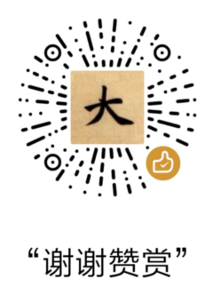

# 区块链学习笔记

本人学习钻研区块链技术的全部记录。

下载本书的电子版：[PDF](https://www.gitbook.com/download/pdf/book/aquayi/blockchain-study-notes),[Mobi](https://www.gitbook.com/download/mobi/book/aquayi/blockchain-study-notes),[ePub](https://www.gitbook.com/download/epub/book/aquayi/blockchain-study-notes)

## 鼓励项目

## 技术交流

点击图片或者扫描二维码加群
